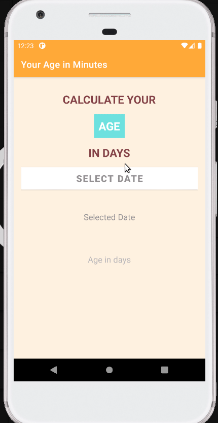

# AgiInMinutes
Application calculating users age in days.

<h3>User can:</h3>

- select date of birth and check how many days have passed since birth,
- user cannot select future date.

<h3>Used technologies:</h3>

- finding views from layout with view binding,
- DatePickerDialog.

<h3>App screenshots:</h3>

App start screen          |  Date picker screen | Calculated age in days screen
:-------------------------:|:-------------------------:|:-------------------------:
  |  |  

<h3>App during usage:</h3>

